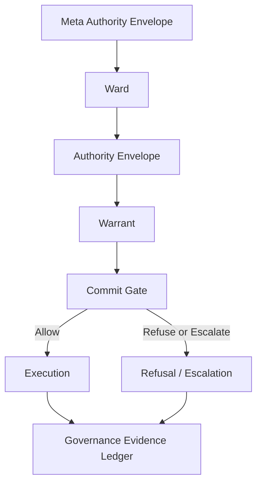

# AristotleOS

AristotleOS is an experimental runtime governance framework for agentic and autonomous systems.

It is designed around a simple principle: machine systems should not cross into consequence without legitimate authority. AristotleOS models that authority through governance primitives such as authority envelopes, warrants, commit gates, wards, runtime registers, and governance evidence ledgers.

The project explores how autonomous agents, AI infrastructure, robotics, drones, defense systems, public infrastructure, and other high-consequence systems can be made bounded, auditable, revocable, and institutionally accountable at runtime.

Core positioning:

> Runtime governance infrastructure for autonomous systems: authority envelopes, warrants, commit gates, and evidence ledgers for bounded, auditable machine action.

The implementation workspace currently lives under [`extracted/`](extracted/).

## What AristotleOS Is

AristotleOS is a TypeScript and pnpm monorepo for experimenting with runtime governance infrastructure.

It is concerned with the boundary between machine capability and authorized consequence. An agent, robot, workflow, or autonomous subsystem may be able to act, but AristotleOS asks whether it is authorized to act in this context, under this authority, with this evidence, at this moment.

The repository includes:

- A deterministic execution-control runtime.
- Ward and Authority Envelope manifests.
- A Commit Gate evaluator.
- Single-use signed Warrants.
- A hash-linked Governance Evidence Ledger.
- Replay and audit tooling.
- CLI and local demo surfaces.
- Agent-framework adapters and protocol-adapter examples.
- Industry vertical examples for domains such as telecom, grid, rail, water, port, logistics, healthcare, automotive, robotics, aviation, space, and others.
- Helm, Kubernetes, Docker Compose, and pilot-install materials.

AristotleOS is not a chatbot framework, an observability dashboard, or a generic "AI safety" wrapper. It is an experimental execution-control substrate for governed machine action.

## Why It Exists

Autonomous systems increasingly have access to tools that can move money, alter records, change infrastructure, command robots, route vehicles, control industrial systems, or trigger operational workflows.

Traditional controls leave a gap:

- IAM authorizes identities and API calls, but usually not the full institutional consequence of a machine action.
- Observability records what happened after the fact.
- Guardrails focus on model output, not necessarily execution authority.
- Logs are often mutable or incomplete as evidence.
- Long-lived credentials create standing machine power.

AristotleOS explores a different pattern: authority should bind at the execution boundary before irreversible state mutation or external action occurs.

## Core Governance Primitives

### Meta Authority Envelope

A root authority document or constitutional policy source. It defines the trust root from which lower-level Wards and delegated authority descend.

### Ward

A protected operational domain with its own rules, boundaries, sovereignty context, and accountable authority. A Ward can represent a plant, fleet, region, mission, institution, regulated workflow, or safety domain.

### Authority Envelope

A scoped delegation defining what a system may do inside a Ward. It binds subject, allowed actions, denied actions, constraints, expiration, issuer, and revocation posture.

### Governance Invariants

Deterministic constraints that cannot be violated. They express non-negotiable policy, safety, operational, or institutional bounds.

### Runtime Registers

The active state used to evaluate admissibility. Runtime registers may include telemetry, policy version, asset state, operator approvals, revocation state, network condition, safety posture, or domain-specific facts.

### Warrant

A single-use authorization token for a specific consequential action. A Warrant is bound to the canonical action hash and proves that an action was admitted at the commit boundary.

### Commit Gate

The deterministic enforcement boundary that allows, refuses, or escalates an action before execution. The Commit Gate evaluates Ward context, Authority Envelope scope, runtime state, invariants, revocation, and warrant requirements.

### Physical Invariant Gater

A hard physical or operational interlock. It is used for cases where software authority is not enough, such as geofence boundaries, power margins, safety envelopes, range safety, equipment limits, or field-state constraints.

### Governance Evidence Ledger

A hash-linked evidence chain of decisions, refusals, warrants, and execution events. The GEL is not ordinary logging; it is intended to support audit, replay, traceability, and tamper detection.

### Model Lineage Certificate

An evidence artifact describing model identity, version, provenance, and authorization status. It is used to connect model participation to the evidence record when model identity matters for governance.

## Architecture

AristotleOS models governed execution as a chain of authority and evidence:

```text
Meta Authority Envelope
-> Ward
-> Authority Envelope
-> Warrant
-> Commit Gate
-> Execution
-> Governance Evidence Ledger
```



The important boundary is not "can the machine generate an action?" The important boundary is "may this machine action become a consequence?"

See [`extracted/ARCHITECTURE.md`](extracted/ARCHITECTURE.md), [`extracted/docs/architecture.md`](extracted/docs/architecture.md), and [`extracted/docs/execution-control-runtime.md`](extracted/docs/execution-control-runtime.md) for deeper architecture notes.

## Basic Flow

1. A system proposes a Canonical Governed Action.
2. AristotleOS resolves the relevant Ward.
3. The Authority Envelope is checked for scope, expiration, revocation, and subject authority.
4. Runtime Registers are read.
5. Governance Invariants and Physical Invariant Gaters are evaluated.
6. The Commit Gate returns `ALLOW`, `REFUSE`, `ESCALATE`, or `EXPIRE`.
7. `ALLOW` can issue a single-use Warrant for that specific action.
8. Execution proceeds only through the governed boundary.
9. The decision, warrant, refusal, escalation, and execution evidence are committed to the GEL.
10. Replay and audit tooling can later reconstruct the decision path.

## Example Use Cases

AristotleOS is being explored for domains where machine action must remain bounded and accountable:

- AI agents calling production tools.
- Kubernetes and infrastructure automation.
- Robotics and drone operations.
- Autonomous vehicle and fleet operations.
- Telecom network operations and NOC workflows.
- Electric grid and water infrastructure control.
- Rail, port, logistics, and pipeline operations.
- Healthcare workflow and clinical operations.
- Space launch and orbital mission operations.
- Defense and other high-consequence mission systems.

The examples are demonstration material unless explicitly marked otherwise. They are useful for engineering evaluation, not for regulatory reliance.

## Current Status

AristotleOS is experimental and pre-1.0.

What exists in this repository:

- Core execution-control runtime and tests.
- Warrant issuance and verification primitives.
- Governance Evidence Ledger primitives and evidence-bundle examples.
- CLI commands and local playground/console surfaces.
- APL policy language experiments.
- Replay, audit, and reviewer verification flows.
- Framework adapter examples.
- Protocol adapter examples.
- Helm, Kubernetes, and Docker Compose deployment materials.
- Extensive docs, threat models, limitations, and proof-status tracking.

What should not be assumed:

- No production deployment is claimed.
- No external security audit is claimed.
- No certification is claimed.
- Hardware and operational adapters are not field validated by default.
- Demo policy packs are not legal, safety, or regulatory determinations.
- KMS/HSM integration, external timestamp anchoring, and field-grade operations remain hardening work.

Read [`extracted/LIMITATIONS.md`](extracted/LIMITATIONS.md) and [`extracted/PROOF_STATUS.md`](extracted/PROOF_STATUS.md) before treating any claim as established.

## Quickstart

From the repository root:

```sh
cd extracted
corepack enable
corepack pnpm@10.32.1 install
pnpm reviewer:verify
```

Run the local console/playground:

```sh
npm run aristotle:demo
```

Then open:

```text
http://127.0.0.1:4173
```

Useful checks:

```sh
npm run typecheck
npm run clean-room
npm run test:space
npm run proof:status
```

For more detail, see [`extracted/docs/quickstart.md`](extracted/docs/quickstart.md), [`extracted/docs/getting-started.md`](extracted/docs/getting-started.md), and [`extracted/examples/reviewer/REVIEWER.md`](extracted/examples/reviewer/REVIEWER.md).

## Repository Structure

```text
.
|-- README.md                         GitHub-facing project overview
|-- LICENSE                           top-level repository license
|-- CLAUDE.md                         local AI-assistant guidance
|-- extracted/                        implementation workspace
    |-- README.md                     workspace README
    |-- package.json                  pnpm workspace scripts
    |-- apps/
    |   |-- aristotle-cli/            CLI
    |   `-- console-ui/               operator console and public trial UI
    |-- shared/
    |   |-- governance-core/          core governance primitives
    |   |-- execution-control-runtime/ Commit Gate, Warrants, GEL, vertical runtimes
    |   |-- mesh-runtime/             disconnected/mesh execution experiments
    |   |-- policy-pipeline/          policy bundle experiments
    |   |-- time-machine/             counterfactual replay
    |   `-- warrant-verifier/         standalone warrant verification
    |-- packages/                     agent, protocol, SDK, and adapter packages
    |-- services/                     service skeletons and control-plane components
    |-- adapters/                     HTTP gateway and related adapters
    |-- examples/                     governed action, vertical, and reviewer examples
    |-- docs/                         architecture, concepts, deployment, threat models
    |-- charts/                       Helm chart materials
    |-- manifests/                    Kubernetes manifests
    `-- scripts/                      validation, install, benchmark, release scripts
```

## Development

Requirements:

- Node.js 22 or newer.
- pnpm 10.32.1 through Corepack.

Common commands:

```sh
cd extracted
corepack enable
corepack pnpm@10.32.1 install
npm run typecheck
npm run clean-room
pnpm reviewer:verify
```

Broader test suites are defined in [`extracted/package.json`](extracted/package.json). The full test matrix is larger than the quick reviewer flow, so use the narrower commands while iterating and the broader CI-oriented commands before release.

## Roadmap

Near-term hardening areas:

- Keep proprietary licensing and third-party dependency notices aligned before external release.
- Publish a versioned reason-code and policy-artifact specification.
- Add deeper property/fuzz testing around canonicalization and Commit Gate behavior.
- Integrate production-grade KMS/HSM signing.
- Add external timestamp anchoring for GEL records.
- Expand real cluster and hardware-in-the-loop validation.
- Harden HA deployment and ledger partitioning guidance.
- Continue separating demonstration rule packs from production-validated operator policy.
- Commission external security review before any safety-critical use.

See [`extracted/ROADMAP_TO_100.md`](extracted/ROADMAP_TO_100.md), [`extracted/VALIDATION_MATRIX.md`](extracted/VALIDATION_MATRIX.md), and [`extracted/docs/readiness-assessment.md`](extracted/docs/readiness-assessment.md).

## License

AristotleOS-original material in this repository is proprietary software. See [`LICENSE`](LICENSE).

No right is granted to use, copy, modify, publish, distribute, sublicense, or sell AristotleOS-original material except under a separate written agreement with the copyright holder.

Third-party dependencies remain governed by their own licenses. See [`extracted/sbom.json`](extracted/sbom.json), package metadata, and dependency notices for dependency terms.

## Disclaimer

AristotleOS is experimental research and engineering software. It is not certified, externally audited, or production validated. It does not replace legal review, regulator coordination, safety engineering, cybersecurity review, or operator accountability.

Do not deploy AristotleOS against safety-critical, regulated, or high-consequence systems without independent validation, production-grade key management, operational runbooks, external security review, and domain authority approval.
