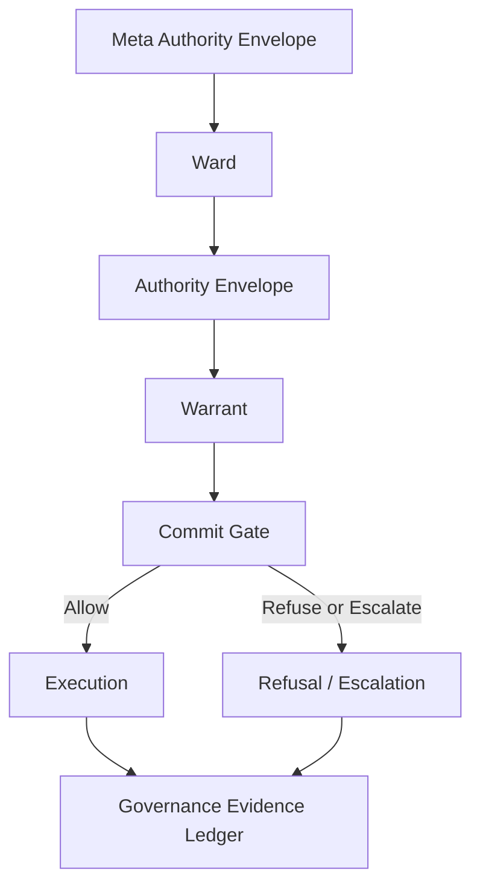

# AristotleOS

AristotleOS is an experimental runtime governance framework for agentic and autonomous systems.

It is designed around a simple principle: machine systems should not cross into consequence without legitimate authority. AristotleOS models that authority through governance primitives such as authority envelopes, warrants, commit gates, wards, runtime registers, and governance evidence ledgers.

The project explores how autonomous agents, AI infrastructure, robotics, drones, defense systems, public infrastructure, and other high-consequence systems can be made bounded, auditable, revocable, and institutionally accountable at runtime.

Core positioning:

> Runtime governance infrastructure for autonomous systems: authority envelopes, warrants, commit gates, and evidence ledgers for bounded, auditable machine action.

This file describes the implementation workspace. If you are viewing the GitHub repository root, the source code lives in this `extracted/` directory.

## Quick start

Watch the substrate take a proposed action through a real Commit Gate, sign a
single-use Warrant, append a hash-linked Governance Evidence Ledger record,
and emit a third-party-verifiable evidence bundle — in two commands:

```sh
# Requires Node ≥22.5 and pnpm ≥10. The repo enforces pnpm via corepack.
git clone https://github.com/AristotleAgentic/AristotleOS && cd AristotleOS/extracted
corepack pnpm@10.32.1 install
corepack pnpm@10.32.1 run execution-control:evidence:demo
corepack pnpm@10.32.1 run execution-control:evidence:verify
```

Expected output from the demo step:

```
decision=ALLOW
reason_codes=ALLOWED
canonical_action_hash=613ba55efbd42e97999129b9ae5a148851a4343a81c6087d5b2c835104d79f01
warrant_id=wrn-568d57a4837361d8c39e524f
signing_key_id=ed25519-dev:0a532aa839bf2afcc901c52da610ffad
gel_record_hash=5eac1ef51f02f0188b2fc97b2badd39c84fe30a5903da335b7ce366d1ad264ea
ledger_verification=ok
evidence_bundle=./.tmp/execution-control-evidence-bundle.json
```

…and from the verify step:

```
evidence_verification=ok
bundle_hash=…
ledger_records=1
```

What the two commands actually do, in substrate terms:

1. `execution-control:evidence:demo` loads a real Ward
   ([`examples/execution_control/ward.montana_drone_test_range.yaml`](examples/execution_control/ward.montana_drone_test_range.yaml))
   and an Authority Envelope, takes a Canonical Action
   ([`examples/execution_control/actions/allow_takeoff.json`](examples/execution_control/actions/allow_takeoff.json)),
   runs it through the deterministic Commit Gate, signs a single-use Warrant
   (Ed25519, ephemeral dev key by default — `aristotle keys generate` produces
   a durable one), appends a record to the GEL, and writes a portable
   evidence bundle.
2. `execution-control:evidence:verify` re-verifies the bundle's hash chain,
   warrant signature, and record consistency **without contacting AristotleOS
   at all** — the bundle is the evidence. Hand it to an auditor and they can
   replay the decision on a clean machine.

To bring up the full nine-service local control plane (governance-kernel +
agent-os + execution-gate + witness-service + meta-authority-registry +
authority-router + evidence-ledger + policy-compiler + simulation-engine, plus
the http-gateway), use `corepack pnpm@10.32.1 run local:up`. Use
`local:status` and `local:down` to manage it.

## Integrations

AristotleOS ships first-party adapters that route tool/action calls from the
following agent frameworks, runtimes, and protocols through the substrate's
Commit Gate before they execute. Every adapter lives in the `packages/`
workspace under `@aristotle/<name>` (TypeScript) or `aristotle-<name>`
(Python). Adapter packages are licensed under Apache-2.0 and are not yet
published to npm / PyPI — use them from the monorepo via `workspace:*` or via
`pip install ./packages/<name>-python`.

### Agent frameworks

| Adapter | Path | Wraps |
|---|---|---|
| `@aristotle/langchain` | `packages/langchain` | LangChain.js tool invocations |
| `aristotle-langgraph` | `packages/langgraph-python` | LangGraph nodes |
| `aristotle-crewai` | `packages/crewai-python` | CrewAI tool calls (sync + async) |
| `aristotle-autogen` | `packages/autogen-python` | AutoGen v0.4 tool calls |
| `aristotle-ag2` | `packages/ag2-python` | AG2 (AutoGen v0.2 fork) tool calls |
| `aristotle-llamaindex` | `packages/llamaindex-python` | LlamaIndex agent tools |
| `aristotle-pydantic-ai` | `packages/pydantic-ai-python` | Pydantic AI agent tools |
| `aristotle-semantic-kernel` | `packages/semantic-kernel-python` | Semantic Kernel functions |
| `@aristotle/mastra` | `packages/mastra` | Mastra tool calls |
| `@aristotle/vercel-ai` | `packages/vercel-ai` | Vercel AI SDK tool calls |

### Model SDKs and agent runtimes

| Adapter | Path | Wraps |
|---|---|---|
| `@aristotle/sdk-anthropic` | `packages/sdk-anthropic` | `@anthropic-ai/sdk` Messages API tool_use blocks |
| `@aristotle/openai-agents` | `packages/openai-agents` | OpenAI Agents SDK tool calls |
| `@aristotle/claude-agents` | `packages/claude-agents` | Claude Code / Claude Agents tool calls |
| `@aristotle/bedrock` | `packages/bedrock` | AWS Bedrock agent tool invocations |

### Model Context Protocol (MCP)

| Adapter | Path | Role |
|---|---|---|
| `@aristotle/mcp-server` | `packages/mcp-server` | MCP server that exposes the substrate's governance primitives as MCP tools |
| `@aristotle/mcp-server-stdio` | `packages/mcp-server-stdio` | stdio transport for the above — drop into Claude Desktop / Cursor / any MCP host |

### Industrial protocols

| Adapter | Path | Protocol |
|---|---|---|
| `@aristotle/dnp3-adapter` | `packages/dnp3-adapter` | DNP3 (utility SCADA) |
| `@aristotle/modbus-adapter` | `packages/modbus-adapter` | Modbus TCP/RTU |
| `@aristotle/bacnet-adapter` | `packages/bacnet-adapter` | BACnet (building automation) |
| `@aristotle/opcua-adapter` | `packages/opcua-adapter` | OPC UA (industrial automation) |

### Robotics

| Adapter | Path | Bridge |
|---|---|---|
| `@aristotle/ros2-bridge` | `packages/ros2-bridge` | ROS 2 action/service calls |
| `@aristotle/mavlink-px4` | `packages/mavlink-px4` | MAVLink / PX4 vehicle commands |

### Kubernetes

| Adapter | Path | Surface |
|---|---|---|
| `@aristotle/k8s-admission` | `packages/k8s-admission` | Kubernetes admission webhook — gates resource mutations through the Commit Gate |

### SDK + gateway clients

| Package | Path | Use |
|---|---|---|
| `@aristotle/os-sdk` | `packages/os-sdk` | TypeScript SDK for the http-gateway's `/v1/*` API |
| `aristotle-os-sdk` | `packages/os-sdk-python` | Python equivalent |
| `@aristotle/gateway-client` | `packages/gateway-client` | OpenAPI-generated typed client for the http-gateway |

### Verticals

Helm overlays for ten regulated/safety-critical domains live under
`charts/aristotle-governance-os/values-<vertical>.yaml` — pipeline, aviation,
grid, healthcare, telecom, rail, water, port, mining, automotive. All are
labeled **DEMONSTRATION ONLY** by design (see ADR-0014 and ADR-0024); they
encode doctrine the substrate has thought through, not deployments it has
ever run in production.

## What AristotleOS Is

AristotleOS is a TypeScript and pnpm monorepo for experimenting with runtime governance infrastructure.

It is concerned with the boundary between machine capability and authorized consequence. An agent, robot, workflow, or autonomous subsystem may be able to act, but AristotleOS asks whether it is authorized to act in this context, under this authority, with this evidence, at this moment.

The workspace includes:

- A deterministic execution-control runtime.
- Ward and Authority Envelope manifests.
- A Commit Gate evaluator.
- Single-use signed Warrants.
- A hash-linked Governance Evidence Ledger.
- Replay and audit tooling.
- CLI and local demo surfaces.
- Agent-framework adapters and protocol-adapter examples.
- Industry vertical examples for domains such as telecom, grid, rail, water, port, logistics, healthcare, automotive, robotics, aviation, space, and others.
- Helm, Kubernetes, Docker Compose, and pilot-install materials.

AristotleOS is not a chatbot framework, an observability dashboard, or a generic "AI safety" wrapper. It is an experimental execution-control substrate for governed machine action.

## Why It Exists

Autonomous systems increasingly have access to tools that can move money, alter records, change infrastructure, command robots, route vehicles, control industrial systems, or trigger operational workflows.

Traditional controls leave a gap:

- IAM authorizes identities and API calls, but usually not the full institutional consequence of a machine action.
- Observability records what happened after the fact.
- Guardrails focus on model output, not necessarily execution authority.
- Logs are often mutable or incomplete as evidence.
- Long-lived credentials create standing machine power.

AristotleOS explores a different pattern: authority should bind at the execution boundary before irreversible state mutation or external action occurs.

## Core Governance Primitives

### Meta Authority Envelope

A root authority document or constitutional policy source. It defines the trust root from which lower-level Wards and delegated authority descend.

### Ward

A protected operational domain with its own rules, boundaries, sovereignty context, and accountable authority. A Ward can represent a plant, fleet, region, mission, institution, regulated workflow, or safety domain.

### Authority Envelope

A scoped delegation defining what a system may do inside a Ward. It binds subject, allowed actions, denied actions, constraints, expiration, issuer, and revocation posture.

### Governance Invariants

Deterministic constraints that cannot be violated. They express non-negotiable policy, safety, operational, or institutional bounds.

### Runtime Registers

The active state used to evaluate admissibility. Runtime registers may include telemetry, policy version, asset state, operator approvals, revocation state, network condition, safety posture, or domain-specific facts.

### Warrant

A single-use authorization token for a specific consequential action. A Warrant is bound to the canonical action hash and proves that an action was admitted at the commit boundary.

### Commit Gate

The deterministic enforcement boundary that allows, refuses, or escalates an action before execution. The Commit Gate evaluates Ward context, Authority Envelope scope, runtime state, invariants, revocation, and warrant requirements.

### Physical Invariant Gater

A hard physical or operational interlock. It is used for cases where software authority is not enough, such as geofence boundaries, power margins, safety envelopes, range safety, equipment limits, or field-state constraints.

### Governance Evidence Ledger

A hash-linked evidence chain of decisions, refusals, warrants, and execution events. The GEL is not ordinary logging; it is intended to support audit, replay, traceability, and tamper detection.

### Model Lineage Certificate

An evidence artifact describing model identity, version, provenance, and authorization status. It is used to connect model participation to the evidence record when model identity matters for governance.

## Architecture

AristotleOS models governed execution as a chain of authority and evidence:

```text
Meta Authority Envelope
-> Ward
-> Authority Envelope
-> Warrant
-> Commit Gate
-> Execution
-> Governance Evidence Ledger
```



The important boundary is not "can the machine generate an action?" The important boundary is "may this machine action become a consequence?"

See [`ARCHITECTURE.md`](ARCHITECTURE.md), [`docs/architecture.md`](docs/architecture.md), and [`docs/execution-control-runtime.md`](docs/execution-control-runtime.md) for deeper architecture notes.

## Basic Flow

1. A system proposes a Canonical Governed Action.
2. AristotleOS resolves the relevant Ward.
3. The Authority Envelope is checked for scope, expiration, revocation, and subject authority.
4. Runtime Registers are read.
5. Governance Invariants and Physical Invariant Gaters are evaluated.
6. The Commit Gate returns `ALLOW`, `REFUSE`, `ESCALATE`, or `EXPIRE`.
7. `ALLOW` can issue a single-use Warrant for that specific action.
8. Execution proceeds only through the governed boundary.
9. The decision, warrant, refusal, escalation, and execution evidence are committed to the GEL.
10. Replay and audit tooling can later reconstruct the decision path.

## Example Use Cases

AristotleOS is being explored for domains where machine action must remain bounded and accountable:

- AI agents calling production tools.
- Kubernetes and infrastructure automation.
- Robotics and drone operations.
- Autonomous vehicle and fleet operations.
- Telecom network operations and NOC workflows.
- Electric grid and water infrastructure control.
- Rail, port, logistics, and pipeline operations.
- Healthcare workflow and clinical operations.
- Space launch and orbital mission operations.
- Defense and other high-consequence mission systems.

The examples are demonstration material unless explicitly marked otherwise. They are useful for engineering evaluation, not for regulatory reliance.

## Current Status

AristotleOS is experimental and pre-1.0.

What exists in this workspace:

- Core execution-control runtime and tests.
- Warrant issuance and verification primitives.
- Governance Evidence Ledger primitives and evidence-bundle examples.
- CLI commands and local playground/console surfaces.
- APL policy language experiments.
- Replay, audit, and reviewer verification flows.
- Framework adapter examples.
- Protocol adapter examples.
- Helm, Kubernetes, and Docker Compose deployment materials.
- Extensive docs, threat models, limitations, and proof-status tracking.

What should not be assumed:

- No production deployment is claimed.
- No external security audit is claimed.
- No certification is claimed.
- Hardware and operational adapters are not field validated by default.
- Demo policy packs are not legal, safety, or regulatory determinations.
- KMS/HSM integration, external timestamp anchoring, and field-grade operations remain hardening work.

Read [`LIMITATIONS.md`](LIMITATIONS.md) and [`PROOF_STATUS.md`](PROOF_STATUS.md) before treating any claim as established.

## Quickstart

From this workspace directory:

```sh
corepack enable
corepack pnpm@10.32.1 install
pnpm reviewer:verify
```

Run the local console/playground:

```sh
npm run aristotle:demo
```

Then open:

```text
http://127.0.0.1:4173
```

Useful checks:

```sh
npm run typecheck
npm run clean-room
npm run test:space
npm run proof:status
```

For more detail, see [`docs/quickstart.md`](docs/quickstart.md), [`docs/getting-started.md`](docs/getting-started.md), and [`examples/reviewer/REVIEWER.md`](examples/reviewer/REVIEWER.md).

## Repository Structure

```text
.
|-- README.md                     workspace README
|-- package.json                  pnpm workspace scripts
|-- apps/
|   |-- aristotle-cli/            CLI
|   `-- console-ui/               operator console and public trial UI
|-- shared/
|   |-- governance-core/          core governance primitives
|   |-- execution-control-runtime/ Commit Gate, Warrants, GEL, vertical runtimes
|   |-- mesh-runtime/             disconnected/mesh execution experiments
|   |-- policy-pipeline/          policy bundle experiments
|   |-- time-machine/             counterfactual replay
|   `-- warrant-verifier/         standalone warrant verification
|-- packages/                     agent, protocol, SDK, and adapter packages
|-- services/                     service skeletons and control-plane components
|-- adapters/                     HTTP gateway and related adapters
|-- examples/                     governed action, vertical, and reviewer examples
|-- docs/                         architecture, concepts, deployment, threat models
|-- charts/                       Helm chart materials
|-- manifests/                    Kubernetes manifests
`-- scripts/                      validation, install, benchmark, release scripts
```

## Development

Requirements:

- Node.js 22 or newer.
- pnpm 10.32.1 through Corepack.

Common commands:

```sh
corepack enable
corepack pnpm@10.32.1 install
npm run typecheck
npm run clean-room
pnpm reviewer:verify
```

Broader test suites are defined in [`package.json`](package.json). The full test matrix is larger than the quick reviewer flow, so use the narrower commands while iterating and the broader CI-oriented commands before release.

## Roadmap

Near-term hardening areas:

- Keep split licensing, package metadata, and third-party dependency notices aligned before external release.
- Publish a versioned reason-code and policy-artifact specification.
- Add deeper property/fuzz testing around canonicalization and Commit Gate behavior.
- Integrate production-grade KMS/HSM signing.
- Add external timestamp anchoring for GEL records.
- Expand real cluster and hardware-in-the-loop validation.
- Harden HA deployment and ledger partitioning guidance.
- Continue separating demonstration rule packs from production-validated operator policy.
- Commission external security review before any safety-critical use.

See [`ROADMAP_TO_100.md`](ROADMAP_TO_100.md), [`VALIDATION_MATRIX.md`](VALIDATION_MATRIX.md), and [`docs/readiness-assessment.md`](docs/readiness-assessment.md).

## License

AristotleOS uses a split licensing model. Substrate material in this workspace is
licensed under BUSL-1.1 with a Change Date of 2030-06-06, adapter and
integration packages under `packages/*` are Apache-2.0, and root `docs/`
material is CC-BY-4.0. See the repository root `LICENSING.md` and the local
[`LICENSE`](LICENSE) for the authoritative map and Additional Use Grant.

The BSL-licensed substrate becomes available under Apache-2.0 on the Change
Date, subject to the BSL terms.

Third-party dependencies remain governed by their own licenses. See [`sbom.json`](sbom.json), package metadata, and dependency notices for dependency terms.

## Disclaimer

AristotleOS is experimental research and engineering software. It is not certified, externally audited, or production validated. It does not replace legal review, regulator coordination, safety engineering, cybersecurity review, or operator accountability.

Do not deploy AristotleOS against safety-critical, regulated, or high-consequence systems without independent validation, production-grade key management, operational runbooks, external security review, and domain authority approval.
