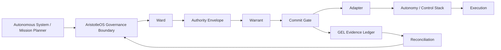
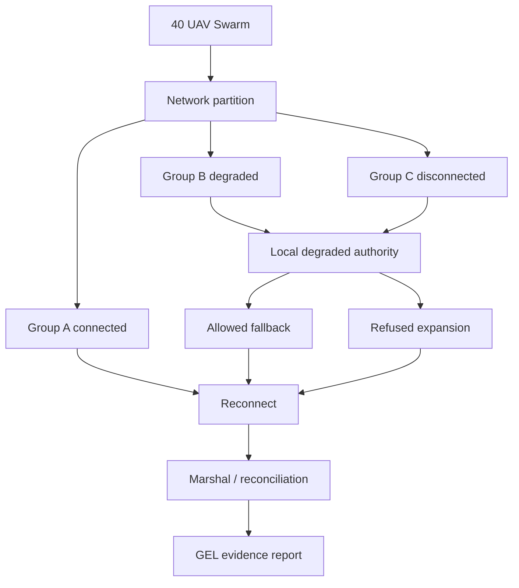

# Commercialization Diagrams

## Architecture Diagram

```mermaid
flowchart LR
  A["Autonomous System / Mission Planner"] --> B["AristotleOS Governance Boundary"]
  B --> C["Ward"]
  C --> D["Authority Envelope"]
  D --> E["Warrant"]
  E --> F["Commit Gate"]
  F --> G["Adapter"]
  G --> H["Autonomy / Control Stack"]
  H --> I["Execution"]
  F --> J["GEL Evidence Ledger"]
  J --> K["Reconciliation"]
  K --> B
```

## Partition / Reconciliation Diagram

```mermaid
flowchart TD
  A["40 UAV Swarm"] --> B["Network partition"]
  B --> C["Group A connected"]
  B --> D["Group B degraded"]
  B --> E["Group C disconnected"]
  D --> F["Local degraded authority"]
  E --> F
  F --> G["Allowed fallback"]
  F --> H["Refused expansion"]
  C --> I["Reconnect"]
  G --> I
  H --> I
  I --> J["Marshal / reconciliation"]
  J --> K["GEL evidence report"]
```
